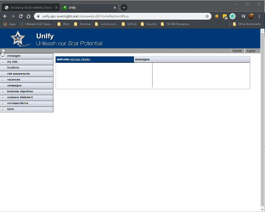

## [Snowdrop Bookmarklets](https://apcovernight.github.io/SnowDropScripts/)

There are some compatability issues with the SnowDrop application, and some more omdern browsers.  Until this issue is resolved by the upsteam vendor, then here are some bookmarklets that can be dragged onto your bookmark bar to add some of the missing functionality back into the product.

  

[🛫 Book My Holiday](javascript:(function(){var accordionMenuFrameSource = $($("#homeMenu>#accordionMenu>iframe")[0]).attr('src');%20var%20from%20=%20accordionMenuFrameSource.lastIndexOf("=");%20var%20UserID%20=%20accordionMenuFrameSource.substr(from+1);%20openDatafileMaster('employees','DisplayNewAbsenceRequest?EDIT_REF='+UserID);})())

 [🤒 See My Absence](javascript:(function(){var accordionMenuFrameSource = $($("#homeMenu>#accordionMenu>iframe")[0]).attr('src');%20var%20from%20=%20accordionMenuFrameSource.lastIndexOf("=");%20var%20UserID%20=%20accordionMenuFrameSource.substr(from+1);%20openDatafileMaster('employees','GridAbsence?EDIT_REF='+UserID);})())

 [🏡 See My Address](javascript:(function(){var accordionMenuFrameSource = $($("#homeMenu>#accordionMenu>iframe")[0]).attr('src');%20var%20from%20=%20accordionMenuFrameSource.lastIndexOf("=");%20var%20UserID%20=%20accordionMenuFrameSource.substr(from+1);%20openDatafileMaster('employees','DisplayOnlyAddress?EDIT_REF='+UserID);})())

 [🏛 See My Bank Details](javascript:(function(){var accordionMenuFrameSource = $($("#homeMenu>#accordionMenu>iframe")[0]).attr('src');%20var%20from%20=%20accordionMenuFrameSource.lastIndexOf("=");%20var%20UserID%20=%20accordionMenuFrameSource.substr(from+1);%20openDatafileMaster('','GridEmployeeBankAccount?EDIT_REF='+UserID);})())

[👤 See My Contacts](javascript:(function(){var accordionMenuFrameSource = $($("#homeMenu>#accordionMenu>iframe")[0]).attr('src');%20var%20from%20=%20accordionMenuFrameSource.lastIndexOf("=");%20var%20UserID%20=%20accordionMenuFrameSource.substr(from+1);%20openDatafileMaster('employees','GridEmployeeContact?EDIT_REF='+UserID);})())
  
[💦 See My Job](javascript:(function(){var accordionMenuFrameSource = $($("#homeMenu>#accordionMenu>iframe")[0]).attr('src');%20var%20from%20=%20accordionMenuFrameSource.lastIndexOf("=");%20var%20UserID%20=%20accordionMenuFrameSource.substr(from+1);%20openDatafileMaster('employees','GridJobHistory?EDIT_REF='+UserID);})())

[👌 See My Review](javascript:(function(){var accordionMenuFrameSource = $($("#homeMenu>#accordionMenu>iframe")[0]).attr('src');%20var%20from%20=%20accordionMenuFrameSource.lastIndexOf("=");%20var%20UserID%20=%20accordionMenuFrameSource.substr(from+1);%20openDatafileMaster('employees','GridEmployeeReview?EDIT_REF='+UserID);})())

[📃 See My Policies](javascript:(function(){var accordionMenuFrameSource = $($("#homeMenu>#accordionMenu>iframe")[0]).attr('src');%20var%20from%20=%20accordionMenuFrameSource.lastIndexOf("=");%20var%20UserID%20=%20accordionMenuFrameSource.substr(from+1);%20openDatafileMaster('employees','GridCompanyDocument?EDIT_REF='+UserID);})())
